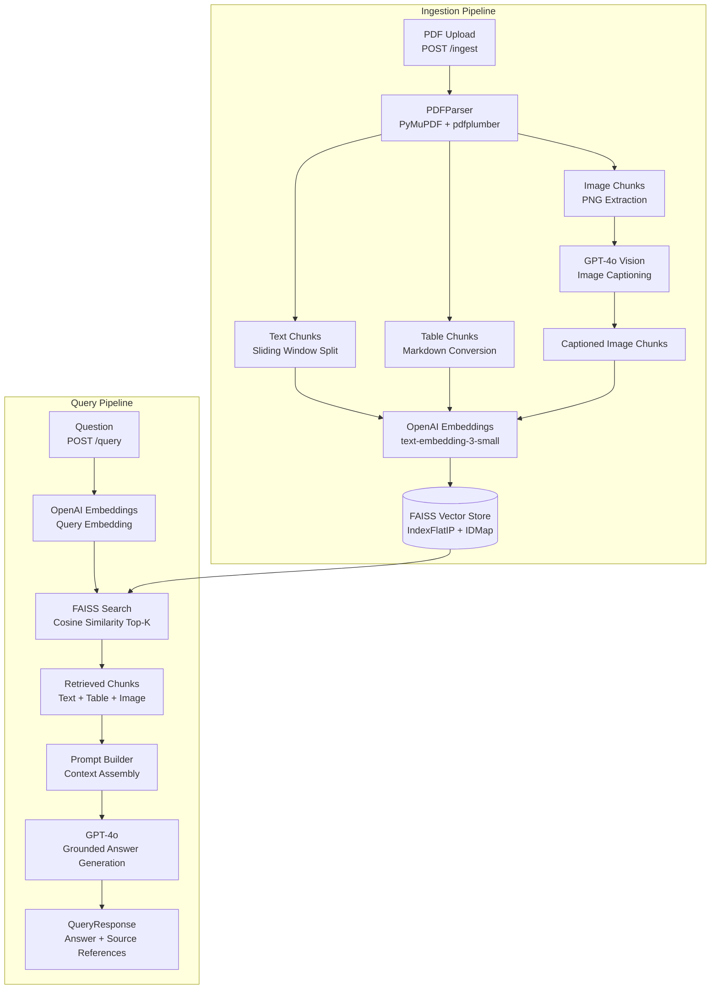

# Multimodal RAG System for Financial Research & Investment Analysis

> **BITS Pilani WILP — Multimodal RAG Bootcamp | Take-Home Assignment**

---

## Problem Statement

### Domain Identification

This system is built for the **financial research and investment analysis** domain — targeting equity research analysts, portfolio managers, and quantitative researchers who consume large volumes of multimodal documents daily: annual reports, earnings call transcripts, investor presentations, sell-side research PDFs, regulatory filings (10-K, 10-Q), and fund factsheets.

### Problem Description

Financial professionals must extract actionable insights from documents that combine dense prose, complex data tables, and rich visualisations (charts, heatmaps, candlestick graphs, geographic distribution maps). A typical equity research report is 40–80 pages and contains:

- **Paragraphs** with qualitative analysis (management commentary, competitive positioning, risk factors)
- **Tables** with financial data (income statements, segment breakdowns, peer comparison matrices)
- **Charts and figures** (revenue trend lines, margin waterfall charts, valuation multiples scatter plots)

Currently, analysts use keyword search (CTRL+F), manual skimming, or expensive third-party tools that index only the text layer of PDFs and discard tables and images entirely. A question like *"What was the EBITDA margin trend shown in the waterfall chart on page 14?"* cannot be answered by any traditional system — the analyst must locate and read the document manually.

### Why This Problem Is Unique

Financial documents present domain-specific RAG challenges that generic Q&A systems are not designed for:

1. **Structured financial tables** — Peer comparison tables use merged cells, multi-level headers, and footnotes. Standard text extractors mangle these into unreadable strings. A misread revenue figure can lead to incorrect investment decisions.

2. **Chart-heavy visualisations** — Sell-side research relies heavily on annotated charts (earnings revisions, relative performance, scenario analysis). These figures convey quantitative information that exists nowhere in the text layer of the PDF. Without vision-language model captioning, this information is completely invisible to any retrieval system.

3. **Specialised terminology** — Financial documents use precise domain vocabulary (CAGR, LTM EBITDA, EV/EBITDA, FCF yield, NIM, CET1 ratio) that generic systems may not handle correctly.

4. **Cross-modal reasoning** — The most analytically valuable insights require connecting text, table, and image content simultaneously. A management commentary (text) must be reconciled with reported numbers (table) and the trend chart (image).

### Why RAG Is the Right Approach

Fine-tuning an LLM on financial documents would require continuous retraining as new reports are published — operationally impractical and expensive. Keyword search cannot handle semantic questions. Manual search does not scale.

RAG is the right architecture because:
- **Freshness** — New research reports can be ingested in seconds without any model retraining
- **Grounding** — Every answer is traced back to a specific chunk, page, and document — auditability is critical in regulated industries
- **Multimodal coverage** — By captioning images with GPT-4o Vision before embedding, chart content becomes semantically searchable
- **Cost-efficiency** — Embedding and retrieval costs are a fraction of running every query through a full document with a long-context LLM

### Expected Outcomes

A successful system enables financial analysts to:
- Ask natural language questions about any ingested research report and receive cited, grounded answers in seconds
- Retrieve relevant table rows ("What were the Q3 2023 gross margins by segment?")
- Retrieve chart interpretations ("What does the revenue growth trajectory chart show for emerging markets?")
- Compare data across multiple ingested documents
- Reduce manual PDF review time from 2–3 hours per report to under 10 minutes

---

## Architecture Overview



---

## Technology Choices

| Component | Choice | Justification |
|-----------|--------|---------------|
| **Document Parser** | PyMuPDF + pdfplumber | PyMuPDF provides fast, accurate text and image extraction. pdfplumber is optimised for financial table detection with multi-column layouts and outperforms fitz's built-in table extractor on documents with merged cells. |
| **Embedding Model** | `text-embedding-3-small` (OpenAI) | Delivers 1536-dimensional embeddings with strong performance at 5× lower cost than `text-embedding-3-large`. No self-hosted infrastructure required. |
| **Vector Store** | FAISS (IndexFlatIP + IDMap) | Zero infrastructure — no external server, no managed service fees. For a single-user research workbench, FAISS in-memory delivers sub-millisecond retrieval. Cosine similarity via L2-normalised inner product. |
| **LLM** | GPT-4o | Best-in-class reasoning on financial text with strong instruction-following for grounded, cited answers. Single-provider (OpenAI-only) keeps the dependency surface minimal. |
| **Vision Model** | GPT-4o (same model) | GPT-4o's vision capability accurately interprets financial charts, bar graphs, and data tables rendered as images. Using one model for both text and vision simplifies the client and reduces latency. |
| **Framework** | FastAPI (raw OpenAI SDK, no LangChain) | Direct SDK calls give full control over prompt construction, retry logic, and error handling without abstraction-layer overhead. |

---

## Repository Structure

```
Bootcamp_assignment/
├── README.md               # This file
├── requirements.txt        # Pinned Python dependencies
├── .env.example            # Template for API keys
├── .gitignore
├── main.py                 # FastAPI app entry point
├── config.py               # Centralised settings (pydantic-settings)
├── llm.py                  # OpenAI client — chat, vision, embeddings
├── parser.py               # PDF parser — text, tables, images
├── pipeline.py             # Ingestion orchestrator
├── vector_store.py         # FAISS vector store with metadata sidecar
├── rag_chain.py            # Retrieval + prompt + answer generation
├── routes.py               # All FastAPI endpoint definitions
├── data/                   # Uploaded PDFs stored here
├── sample_documents/       # Domain-specific sample PDF for evaluation
└── screenshots/            # Evidence screenshots (see Section below)
```

---

## Setup Instructions

### Prerequisites

- Python 3.10 or higher
- An OpenAI API key with access to `gpt-4o` and `text-embedding-3-small`

### 1. Clone the repository

```bash
git clone https://github.com/your-username/Bootcamp_assignment.git
cd Bootcamp_assignment
```

### 2. Create a virtual environment

```bash
python -m venv venv
source venv/bin/activate        # macOS / Linux
# venv\Scripts\activate         # Windows
```

### 3. Install dependencies

```bash
pip install -r requirements.txt
```

### 4. Configure environment variables

```bash
cp .env.example .env
```

Open `.env` and set your API key:

```
OPENAI_API_KEY=sk-...
```

### 5. Create the data directory

```bash
mkdir -p data
```

Place any PDF you want to pre-load here, or upload via the API.

### 6. Start the server

```bash
python main.py
```

The server starts at **http://localhost:8000**  
Swagger UI: **http://localhost:8000/docs**

---

## API Documentation

### `GET /health`

Returns system status: model readiness, indexed document count, total chunks, and uptime.

**Sample response:**
```json
{
  "status": "ok",
  "model": "gpt-4o",
  "embedding_model": "text-embedding-3-small",
  "indexed_documents": 2,
  "total_chunks": 134,
  "uptime_seconds": 182.4
}
```

---

### `POST /ingest`

Upload a PDF file. The system extracts text, tables, and images; captions images with GPT-4o Vision; embeds everything; and adds to the FAISS index.

**Request:** `multipart/form-data` with field `file` (PDF only)

**Sample response:**
```json
{
  "filename": "annual_report_2023.pdf",
  "text_chunks": 48,
  "table_chunks": 12,
  "image_chunks": 7,
  "total_chunks": 67,
  "processing_time_seconds": 24.3
}
```

**Error responses:**
- `400` — File is not a PDF
- `500` — Parsing or embedding failure

---

### `POST /query`

Ask a natural language question. Retrieves the most relevant chunks and generates a grounded GPT-4o answer with source references.

**Request body:**
```json
{
  "question": "What does the revenue waterfall chart show for Q3?",
  "top_k": 5
}
```

**Sample response:**
```json
{
  "question": "What does the revenue waterfall chart show for Q3?",
  "answer": "The revenue waterfall chart on page 18 of 'Q3_Report.pdf' shows that total revenue declined by $12M in Q3 2023. The primary drivers were a $18M drop in the APAC segment, partially offset by $6M growth in North America...",
  "sources": [
    {
      "chunk_id": "Q3_Report.pdf_p18_a4f2c1d8",
      "source_file": "Q3_Report.pdf",
      "page_number": 18,
      "chunk_type": "image",
      "content_preview": "[Figure on page 18] A revenue waterfall chart showing..."
    }
  ],
  "chunks_retrieved": 5,
  "model_used": "gpt-4o"
}
```

**Error responses:**
- `404` — No documents indexed yet
- `500` — Embedding or generation failure

---

### `GET /documents`

List all document filenames currently indexed.

**Sample response:**
```json
{
  "documents": ["annual_report_2023.pdf", "Q3_earnings.pdf"],
  "total_documents": 2
}
```

---

### `DELETE /documents/{filename}`

Remove all chunks for a specific document from the vector index.

**Sample response:**
```json
{
  "message": "Removed annual_report_2023.pdf from index.",
  "filename": "annual_report_2023.pdf",
  "chunks_removed": 67
}
```

---

### `GET /docs`

FastAPI auto-generated Swagger / OpenAPI interactive documentation. Available at `http://localhost:8000/docs` when the server is running.

---

## Screenshots

Place all screenshots in the `screenshots/` folder.

| File | What to capture |
|------|----------------|
| `screenshots/01_swagger_ui.png` | `/docs` page showing all endpoints |
| `screenshots/02_ingest_response.png` | POST `/ingest` with a multimodal PDF and the JSON response |
| `screenshots/03_text_query.png` | POST `/query` returning a text-based chunk answer |
| `screenshots/04_table_query.png` | POST `/query` returning a table-based chunk answer |
| `screenshots/05_image_query.png` | POST `/query` returning an image/figure chunk answer |
| `screenshots/06_health_endpoint.png` | GET `/health` showing indexed document count |

Embed them here once captured:

```markdown


```

---

## Limitations & Future Work

### Current Limitations

1. **Deletion does not purge vectors** — FAISS `IndexFlatIP` does not support in-place vector removal. When a document is deleted, its metadata is removed but the vectors remain until the server restarts. A production system would use Weaviate, Pinecone, or Qdrant which support native delete.

2. **No authentication** — The API has no auth layer. For production deployment, OAuth2 or API key middleware should be added via FastAPI's security utilities.

3. **Single-node, in-memory index** — FAISS runs in-process and does not support horizontal scaling. For corpora exceeding 10,000 pages, a distributed vector store (Milvus, Pinecone) would be required.

4. **Image captioning latency** — Captioning each image with GPT-4o adds 2–5 seconds per image. A 60-page PDF with 10 figures may take 60–90 seconds to ingest. Async parallel captioning would reduce this significantly.

5. **Table extraction on scanned PDFs** — pdfplumber performs well on native PDFs but fails on scanned/image-based PDFs. Integrating OCR (Amazon Textract or Tesseract) would improve coverage.

### Future Work

- **Metadata filtering** — Migrate to ChromaDB or Qdrant to support filtering by `chunk_type`, `source_file`, date, or custom tags (ticker symbol, sector)
- **Re-ranking** — Add a cross-encoder re-ranker as a second retrieval stage to improve precision beyond embedding similarity
- **Streaming responses** — Stream the GPT-4o answer via Server-Sent Events for faster perceived latency
- **Evaluation harness** — Add an automated RAG evaluation suite (RAGAS) with ground-truth QA pairs from the financial domain
- **Multi-document comparison** — Enable queries that explicitly compare data across two or more ingested documents